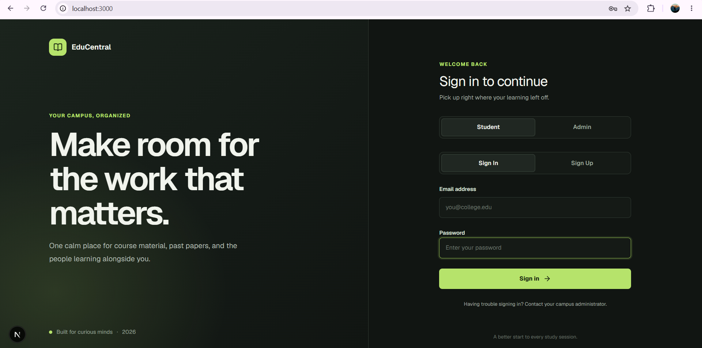
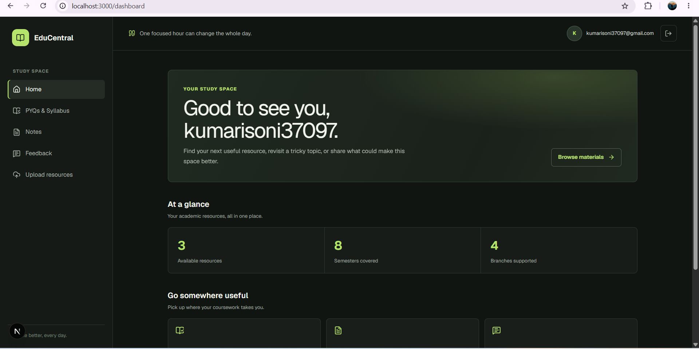
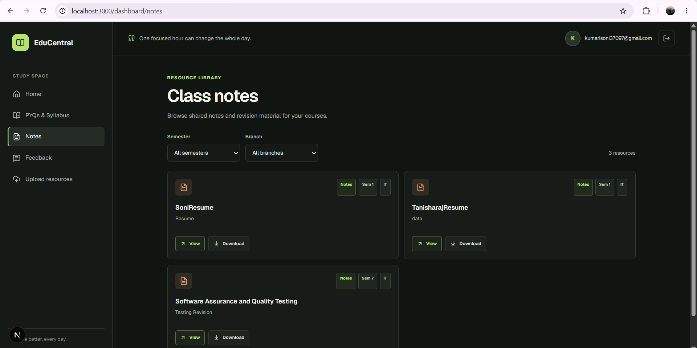

# EduCentral

EduCentral is a full-stack student resource portal designed to simplify and streamline academic resource management for college students and faculty.EduCentral is a student resource portal built with Next.js App Router, Tailwind CSS, and Supabase

## Features

- 📚 Study materials organized by semester, subject, and branch
- 🔐 Secure admin-managed resource uploads
- 📝 Student feedback system
- 🎯 Row-level security with Supabase



## 💡 Why EduCentral?

During college, students frequently face common management issues:
- Study materials, lecture notes, and syllabi are scattered across disparate WhatsApp groups, emails, and cloud drives.
- Class representatives and administrators struggle to organize files and enforce secure access control.
- There is no central, structured place for students to voice feedback or requests regarding academic materials.
  
## Local setup

Add the following to `.env.local` (without spaces around `=`):

```env
NEXT_PUBLIC_SUPABASE_URL=[https://your-project.supabase.co](https://your-project.supabase.co)
NEXT_PUBLIC_SUPABASE_ANON_KEY=your-supabase-anon-key
```

Run `supabase/schema.sql` in the Supabase SQL Editor, then start the app:

```bash
npm install
npm run dev
```

## Screenshots

### Dashboard


### Resource Upload


## Administrator access

Sign-in role checks use the server-managed `app_metadata.role` claim. Set it to `admin` for administrator accounts using a trusted server-side Supabase Admin API operation. Never grant roles through editable `user_metadata` or expose the service-role key in this app.

## Supabase contracts

The setup SQL creates the `resources` and `feedback` tables, enables row-level security, and configures the public `study-materials` PDF bucket. Resource records use `title`, `category`, `semester`, `subject`, `branch`, `file_url`, and nullable `uploaded_by`. Existing `public_url` values are migrated into `file_url`. The bucket is public so students can open the stored materials directly.

## Tech Stack

- **Frontend**: Next.js 14 (App Router), Tailwind CSS
- **Backend**: Supabase (PostgreSQL, Auth, Storage)
- **Deployment**: Vercel

## Contributing

1. Fork the repository
2. Create a feature branch
3. Commit your changes
4. Push to the branch
5. Open a Pull Request
